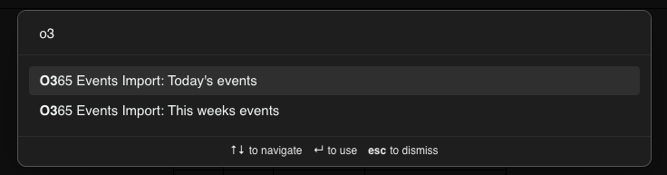
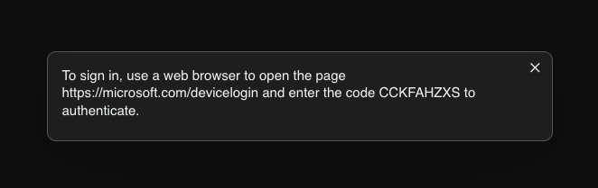
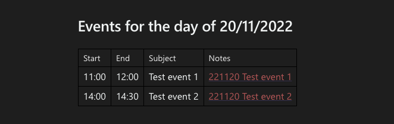
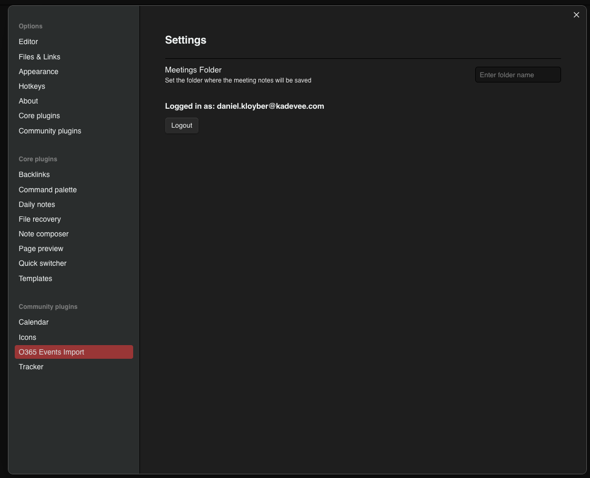

# Obsidian Office 365 import

### Basic information

A basic plugin that will import todays or this weeks events into an Obsidian table. 

Created mostly around my daily routine of starting the day with the preparation of current meetings and events, the 
plugin will use device authentication to facilitate a simple integration of Obsidian and Office 365. 

For now only O365 accounts are supported - if there is a need we can easily add also Outlook/Hotmail/Live.com integration. 

### How to start 

- Open the command menu (CommandKey + P)
- Type O365
- Pick one of the two options 
- Authenticate by going to the specified URL and entering the code the app displays 

- Credentials should be cached for a longer period, so you only need to authenticate once every 60 days or so. 

- The events should appear in the note you have currently opened. 

### Settings and other stuff 

In the settings menu you have a couple of options / actions that are specific to the plugin:
- you can logout the current user 
- specify the folder where event notes will be auto-created. 

